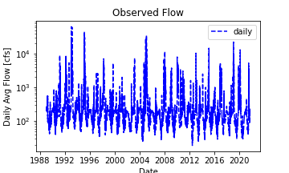
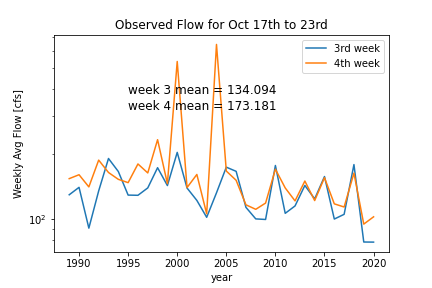
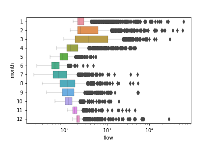

### Xingyu Zhang
### 10/10/2021
### Assignment 7

 

### Code instruction
- please download this file in the code_review1 folder; some code may be not as efficient and effective as we expected. Therefore, please leave your revision or suggestions at the end of this file.
- You will see three plots generated after the run, which will be used in this markdown file.
- Go through the generated plots and have a sense of what the flow will be for next week (hint: we know the October mean and the evolution trend of October flow this year; then guess a value).
- Fill all blanks.
 

### Forecast
We generated three plots as follows:
1. Time series plot of observed daily flow during 1989-2021. The time series is stationary.
  

2. Boxplot of daily observed flow before and after 2014: we see the distribution of October flow changes during these two periods. The time series is stationary with 12 month peried change
  

3. boxplot the flow difference between each month.Jun has the lowest flow and Mar has the largest.
  
  
- Therefore, we forecasted weekly mean for next week and two weeks laters should be (80) and (80) cfs, respectively. 
 

### Code revision or suggestion
- First, ()
- Second, ()
- Third, ()