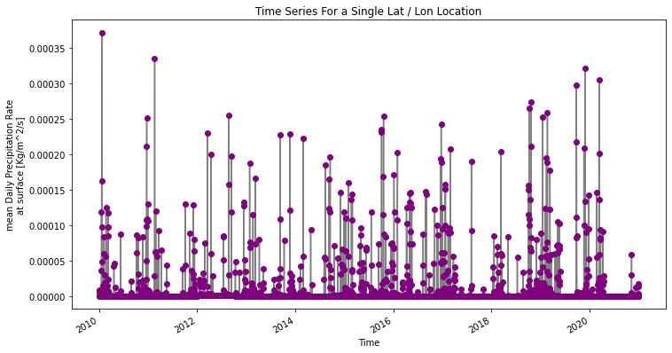

### Xingyu Zhang
### Assignment 9
### 10/24/2021

 

1.A brief summary of the how you chose to generate your forecast this week.

 I adda historical time series that you add to your regression model

2.A description of the dataset you added
What is the dataset? Why did you choose it?
What is the spatial and temporal resolution and extent of the data ?
Where did you get the data from?
What was your approach to extracting and aggregating it into something useful to you?

NCEP Reanalysis Daily Average.

such data include a whole time series so that it is easy to make a regression analysis

the spatial is 33-37N, 246-250E
the temporal is 2000-2020 year.

The data came from PSL

My approach to extracting and aggregating it is to make a week average.

3.A plot of the dataset you added. This can be a timeseries, map, histogram or any other plot that you think is a good summary of what you added.
Finally add your plot and a brief summary of what you did to our slide deck for this week here
   
