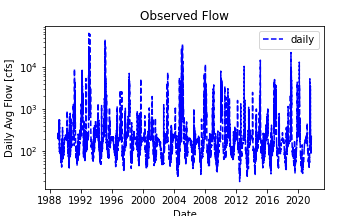
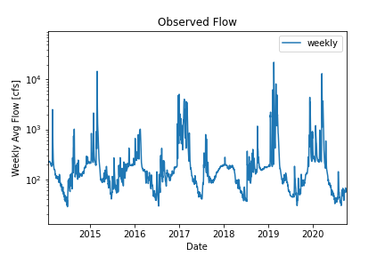
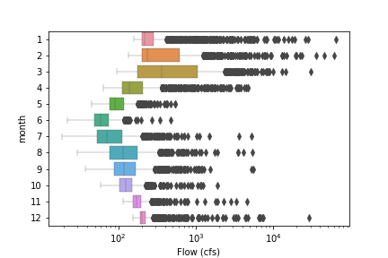
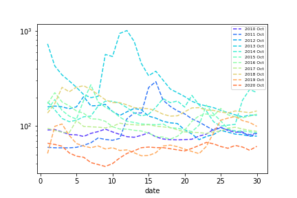
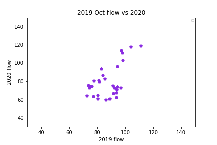
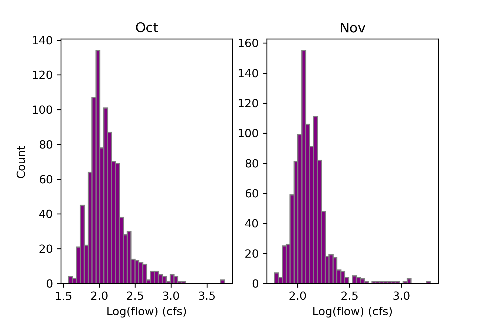

### Xueyan Zhang
### 10/03/2021
### Assignment 6
 

____
## Grade
3/3: Great work! Thank you for adding the markdown formatting it is much easier to follow now. I like all the updates you made to the plots. 
___

### Summary and supporting plots
Given September flow values and October flow distribtuion, I predicted flows during next week and two weeks later are 80 cfs and 80 cfs, respectively.
 
1. Time series plot of observed daily flow during 1989-2021. The time series is stationary.
     

2. Boxplot of daily observed flow before and after 2014: we see the distribution of October flow changes during these two periods. The time series is stationary with 12 month peried change
   

3. boxplot the flow difference between each month.Jun has the lowest flow and Mar has the largest.
     

4.  Observed October flows during 1989-2021: We can see October flow in 2021 starts really high compared to other years with a decreasing trend.
    

5. The comparison of 2019 and 2020 October flow, which suggests October flow has no severe climate in both 2019 and 2020.
    

6. Two histograms of October and November flow have values. Oct has more severe climate
    