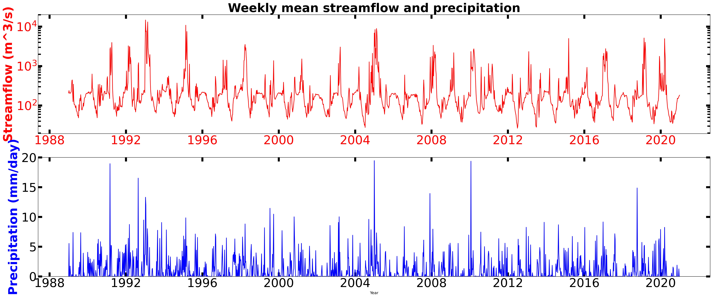
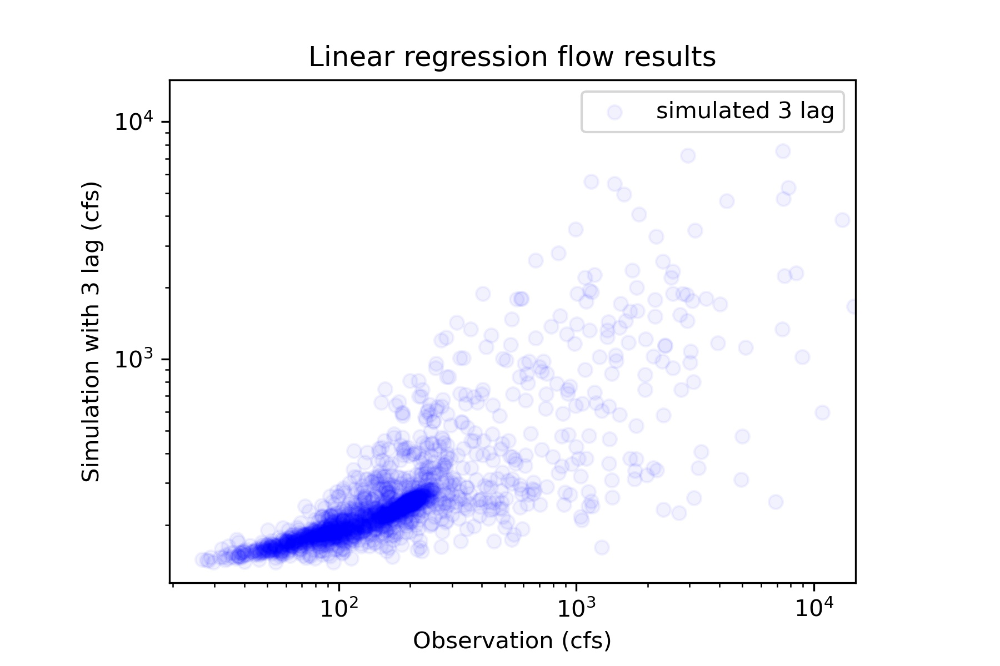

### Xingyu Zhang
### Assignment 9
### 10/24/2021

## Grade:
**0/3:** I'm revisign your grade to 0 here because after talking with Xueyan and reviewing your two scripts it does not appear that you have done any independent work on this assignment. Please see me to discuss. 

-- One note I'm fine with collaboraiton but I'm concerrned at the level of similarity between you and Xueyan's written assignments. You both have very similarly worded answers and you have downloaded the same data and gotten the same coefficien of determination on your models. Its fine if you are working together but it needs to be clear that you are doing your own work too. Let me know if you need any help from me to clarify what I mean by this. 
____________
 

1. A brief summary of the how you chose to generate your forecast this week.
   
   The model I use here is a AR(3) time series model. The coefficient of determination is 0.33. The forecast for this week is 258 cfs and 255 for next week .

2. A description of the dataset you added
* What is the dataset? Why did you choose it?
  
  The dataset I use is daymet precipitation dataset because daymet has a resolution of 4 km and can reflect the average precipitation input condition near the USGS gage. 

* What location have you chosen?
  
  I picked a grid cell with latitude of 34.448 and longitude of -111.789, same as the basin location.

* Where did you get the data from? What was your approach to accessing it?
  
  I used url method to get the data from daymet api.

3. A plot of your additional time series along with your streamflow time series.
   
4. A plot that illustrates how you chose your forecast values.
   